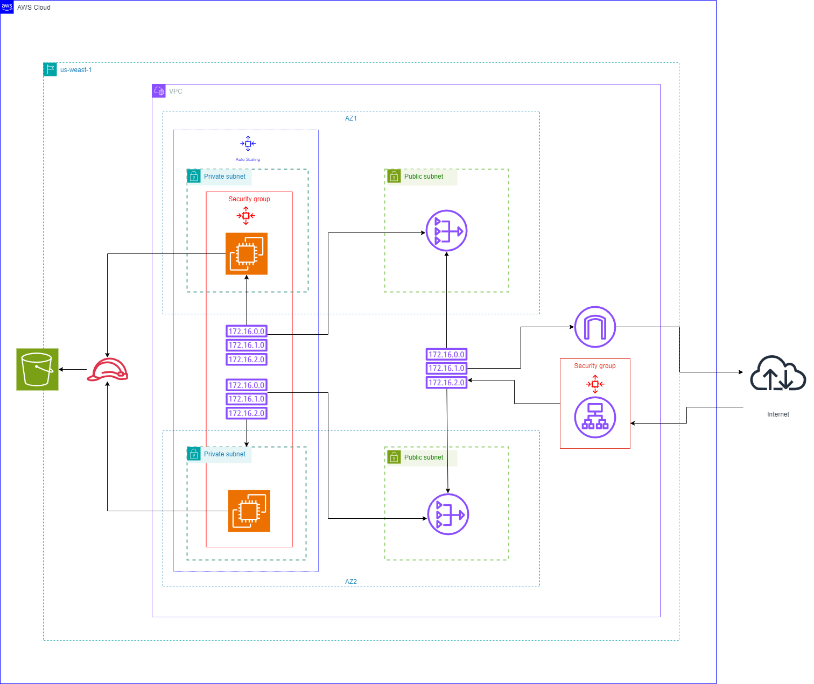

# Solution Diagram

# CloudFront Templates:

- network.yml: Create the necesary network assets.
- udagram.yml: Create the necesary resources (security groups, autoscaling groups, load balancers, launche template, etc.).

# Scripts

# AWS CloudFormation Script - run.bat

run.bat: Tears up or tears down the infrastructure.

### Prerequisites

- [AWS CLI](https://aws.amazon.com/cli/) installed and configured.
- Basic understanding of AWS CloudFormation.

### Options:

### 1. emptyS3

Empty an S3 bucket.

Usage: run.bat emptyS3 <S3BUCKET> <REGION> <PROFILE>

S3BUCKET: The name of the S3 bucket to be emptied.
REGION: The AWS region where the S3 bucket is located.
PROFILE: The AWS CLI profile to be used.

### 2. uploadS3

Upload a file to an S3 bucket.

Usage: run.bat uploadS3 <S3BUCKET> <REGION> <PROFILE> <FILE>

S3BUCKET: The name of the S3 bucket to upload the file to.
REGION: The AWS region where the S3 bucket is located.
PROFILE: The AWS CLI profile to be used.
FILE: The path to the file to be uploaded.

### 3. deploy

Deploy a CloudFormation stack.

Usage: run.bat deploy <STACK_NAME> <TEMPLATE_NAME> <PARMS_NAME> <REGION>

STACK_NAME: The name of the CloudFormation stack to be deployed.
TEMPLATE_NAME: The path to the CloudFormation template file.
PARMS_NAME: The path to the parameter file for the CloudFormation stack.
REGION: The AWS region where the CloudFormation stack will be deployed.

### 4. delete

Delete a CloudFormation stack.

Usage: run.bat delete <STACK_NAME> <REGION> <PROFILE>

STACK_NAME: The name of the CloudFormation stack to be deleted.
REGION: The AWS region where the CloudFormation stack is located.
PROFILE: The AWS CLI profile to be used.

### 5. preview

Preview changes for a CloudFormation stack.

Usage: run.bat preview <STACK_NAME> <TEMPLATE_NAME> <PARMS_NAME> <REGION>

STACK_NAME: The name of the CloudFormation stack to preview changes for.
TEMPLATE_NAME: The path to the CloudFormation template file.
PARMS_NAME: The path to the parameter file for the CloudFormation stack.
REGION: The AWS region where the CloudFormation stack is located.
Make sure to adjust the values in these examples according to your actual use case and AWS environment.

## Example usage:

To tear up:

./run.bat deploy MyStackName template.yaml parameters.json us-west-2 my-profile

if the stack created and S3 Bucket, use this to upload the index.html to test the cloudfront

./run.bat uploadS3 MyS3Bucket us-west-2 my-profile myfile.txt

Preview Modifications:

You can use to create change set using the "preview" action

./run.bat deploy MyStackName template.yaml parameters.json us-west-2 my-profile

To tear down:

Empty the S3 bucket

./run.bat emptyS3 MyS3Bucket us-west-2 my-profile

Delete the stack

./run.bat delete MyStackName us-west-2 my-profile
